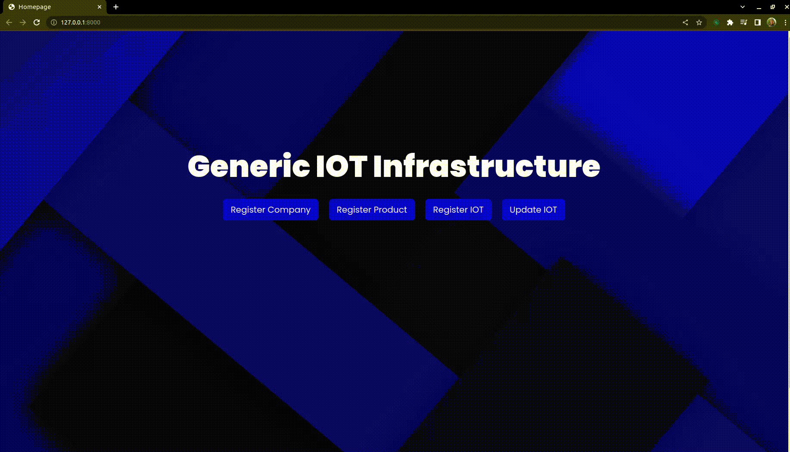
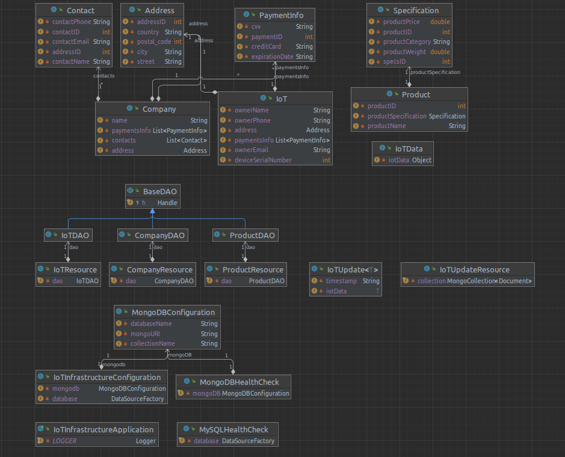
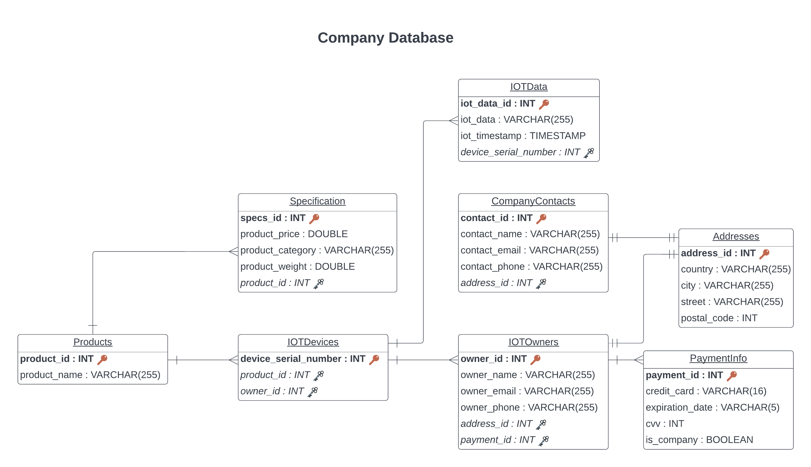
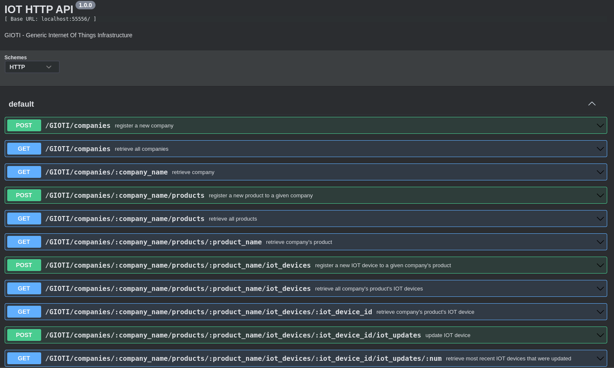

# IoT Infrastructure

### UI



### UML



### SQL Database



### Swagger API


## Table of Contents
- [Overview](#0-overview)
- [Usage](#1-usage)
- [Project Structure](#2-project-structure)

### 0. Overview

Developed an end-to-end multithreaded infrastructure system for companies to efficiently manage their product and IoT data via REST API. Implemented backend using Dropwizard framework(Java and Gradle) and frontend with Django framework(Python). Utilized MySQL and MongoDB for data storage, implemented a robust monitoring system for automatic restart watchdog process in case of a crash and added Notification microservice with RabbitMQ for logging support. Followed SOLID principles and test-driven development practices while making use of Git for version control and GitHub Actions for CI/CD. Lastly, containerized application using Docker ensuring isolated environment.

Project was built with Dropwizard which straddles the line between being a library and a framework. Its goal is to provide performant, reliable implementations of everything a production-ready stateless RESTful APIs

1. `Jetty` - dropwizard projects have a `main` method which spins up an HTTP web-server
2. `Jersey` - maps HTTP requests to simple Java objects via RESTful API
3. `Jackson` - king of JSON on the JVM. convert JSON to POJO and vice versa via object mapper
4. `Metrics` - provides ways to measure the behavior of components in production environment
5. `Logback` - the successor to `Log4j`, Java's most widely-used logging framework
6. `Hibernate` - provides user input validation
7. `JDBI` - provides convenient and idiomatic access to relational database with Java

Dropwizard consists mostly of **glue code** to automatically connect and configure these components.

### 1. Usage
To set up the project locally, follow these steps:

1. Clone the repository to your local machine.
2. Make sure you have JDK installed.
3. Setup databases: (1) sudo mysql -u bar -p; , (2) sudo systemctl start mongod; -> mongosh;
4. Run NotificationMicroservice
5. Build and Run the project using `./gradlew build` and `./gradlew run` or via IDE configurations with `server config.yml` program arguments
6. Use Postman for GET/Post requests or navigate to `http://localhost:8000` in your web browser

#### Running with Docker

1. Build the Docker image using `docker build -t iot_infrastructure .`
2. Run a Docker container based on the image built using `docker run -p 8080:8080 iot_infrastructure`

Once the application is running, you can access the RESTful endpoints by navigating to `http://localhost:8080` in your web browser or using tools like cURL or Postman.

### 2. Project Structure
The project structure follows a standard Gradle directory layout:

```
.
├── build.gradle     
├── gradle
│   └── wrapper
│       ├── gradle-wrapper.jar
│       └── gradle-wrapper.properties
├── settings.gradle    
├── src
│   ├── main
│   │   ├── java      
│   │   ├── resources  
│   │   
│   └── test
│       ├── java        
│       └── resources
└── README.md  
└── config.yml       
└── Dockerfile       
```
